# End-to-End Autonomous Driving: VLA + World Models + RL

A comprehensive showcase repository for state-of-the-art autonomous driving research, covering **end-to-end planning**, **vision-language-action agents**, **world models**, and **reinforcement learning in simulation** — built from scratch with real nuScenes data and pretrained model integration.

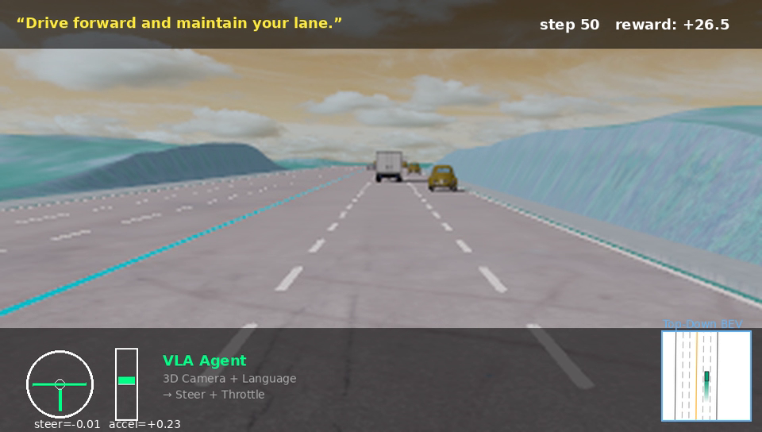

> *Vision-Language-Action agent driving in MetaDrive 3D simulation. The agent receives a first-person camera view + a language command, and outputs steering and throttle.*

---

## What's Inside

This repo demonstrates **5 different paradigms** for autonomous driving, each with working code, training pipelines, and visualization:

| # | Module | Paradigm | Data Source | Status |
|---|---|---|---|---|
| 1 | **End-to-End Planner** | UniAD-style perception → planning | nuScenes mini | Trained, demo works |
| 2 | **VLA Agent (real data)** | DriveVLM + Qwen2.5-VL reasoning | nuScenes mini | Trained, demo works |
| 3 | **World Model** | BEV VAE + Vista pretrained | nuScenes mini + Vista | Working with Vista |
| 4 | **RL Simulation** | PPO/DQN in highway-env + MetaDrive | Synthetic | Trained, demo works |
| 5 | **VLA RL Sim** | Vision + Language + Action in 3D sim | Synthetic | Trained, demo + video |

---

## Quick Start

```bash
git clone https://github.com/wusimo/ad-world-models.git
cd ad-world-models
pip install -e ".[dev]"
```

Then jump to any module below — each is self-contained.

---

## 1. End-to-End Planner (UniAD-style)

A unified transformer that does **detection → motion forecasting → planning** in a single forward pass on multi-camera images.

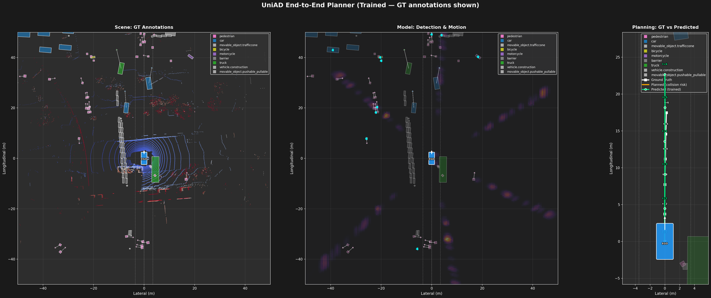

**Architecture:**
```
6 Cameras → ResNet50 → Lift-Splat-Shoot BEV (256×200×200)
              → DETR Detection (300 queries)
              → Motion Forecasting (6 modes × 6 timesteps per agent)
              → Planning (collision-aware GRU → 6 waypoints)
```

**Training:** L1 loss on ego trajectory. The gradient flows back through all heads, giving even the detection module useful supervision from the planning objective.

**Results:** After training on nuScenes mini (~8 min on RTX 3090), the predicted trajectory (green) closely follows the ground truth (white) ~17m forward.

```bash
# Download nuScenes mini (~4GB, requires free registration at nuscenes.org)
python scripts/download_nuscenes_mini.py --dataroot ./data/nuscenes

# Train (~8 min)
python scripts/train_e2e_planner.py

# Demo
python -m src.e2e_planner.demo
```

**Output**: `outputs/e2e_planner/e2e_planner_output.png` — 3 panels showing GT scene with LiDAR + boxes, model detections + BEV heatmap, and trajectory comparison.

📄 **Reference**: [UniAD](https://github.com/OpenDriveLab/UniAD) (CVPR 2023 Best Paper)

---

## 2. VLA Agent with Pretrained Vision-Language Model

A Vision-Language-Action agent that uses **Qwen2.5-VL-3B** (a real pretrained VLM) for Chain-of-Thought scene reasoning, combined with a trained trajectory decoder for waypoint planning.

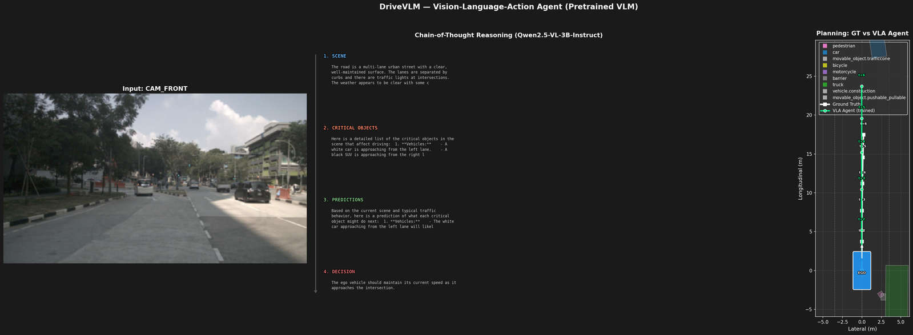

**Three-panel demo**:
1. **Left**: Front camera input from nuScenes
2. **Center**: Real Chain-of-Thought reasoning from Qwen2.5-VL — scene description, critical objects, behavior prediction, ego decision
3. **Right**: GT trajectory (white) vs VLA-predicted trajectory (green, ~24m forward, matches GT)

**Architecture:**
```
Camera Image → Qwen2.5-VL-3B → CoT Reasoning (text)
                                ↓
Multi-Camera → BEV → Visual Projector → LM hidden state
                                          ↓
                                  Trajectory Decoder → 6 waypoints
```

**Sample VLM output**:
> 1. SCENE: Multi-lane urban street with traffic lights, clear weather, modern buildings
> 2. CRITICAL OBJECTS: White car approaching from left lane, black SUV from right, bus and truck further ahead
> 3. PREDICTIONS: White car likely continues straight or turns left at intersection
> 4. DECISION: Maintain current speed approaching intersection

```bash
# Train trajectory decoder (~5 min)
python scripts/train_vla_agent.py

# Demo (downloads Qwen2.5-VL-3B on first run, ~7GB)
python -m src.vla_agent.demo
```

📄 **Reference**: [DriveVLM](https://arxiv.org/abs/2402.12289)

---

## 3. World Models (BEV + Vista Pretrained)

Two world model implementations side-by-side: a small **BEV-space VAE** trained from scratch and the pretrained **Vista** (NeurIPS 2024) for photorealistic future prediction.

### Action-Conditioned Imagined Futures (Vista)

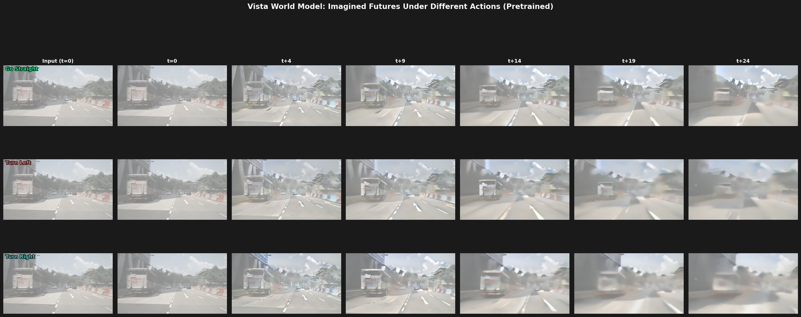

Each row shows a different driving action — the Vista model generates photorealistic future frames conditioned on the trajectory:
- **Go Straight**: Scene progresses forward, traffic and road markings evolve naturally
- **Turn Left**: Scene drifts rightward as ego turns left
- **Turn Right**: Scene drifts leftward as ego turns right

### BEV Features vs Pixel Space

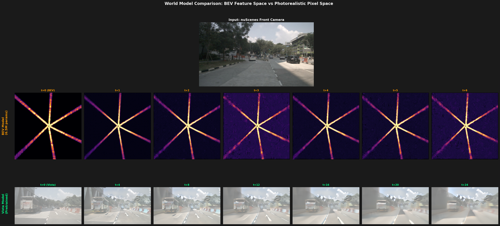

Top: input front camera image
Middle: Our BEV world model — abstract 256-channel feature maps (the "star" pattern is the projection of 6 cameras into BEV space)
Bottom: Vista's photorealistic pixel-space prediction

### Vista Filmstrip (Real vs Imagined)

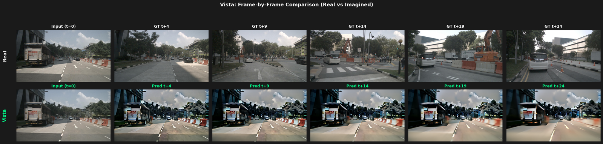

Top row: Real nuScenes ground-truth frames
Bottom row: Vista's imagined future from a single input image

```bash
# Train BEV world model (~3 min)
python scripts/precompute_bev.py
python scripts/train_world_model.py

# Set up Vista (clone repo + download 9.4GB weights)
cd ..
git clone https://github.com/OpenDriveLab/Vista.git
python -c "from huggingface_hub import hf_hub_download; hf_hub_download('OpenDriveLab/Vista', 'vista.safetensors', local_dir='Vista/ckpts')"

# Run Vista for action scenarios (each ~5 min on 24GB VRAM)
cd ad-world-models
for action in free straight left right; do
  python scripts/run_vista_single.py --action $action \
    --output_dir outputs/vista_scenarios/$action --n_steps 5
done

# Run combined demo
python -m src.world_model.demo
```

📄 **Reference**: [Vista](https://arxiv.org/abs/2405.17398) (NeurIPS 2024), [GenAD](https://arxiv.org/abs/2403.09630) (CVPR 2024)

---

## 4. Reinforcement Learning in Driving Simulators

Two simulators with PPO/DQN training and visualization:

### highway-env (lightweight 2D)

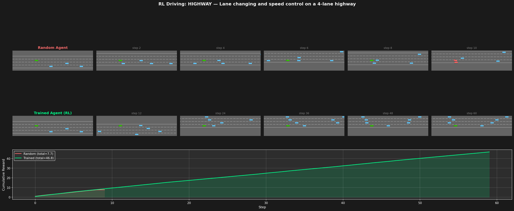

Top row: random agent crashes early (red ego vehicle)
Bottom row: trained DQN agent stays in lane through 60+ steps
Reward: 7.7 (random) → 46.8 (trained)

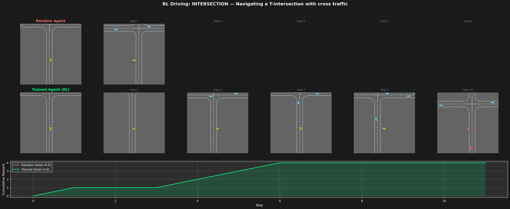

T-intersection with cross traffic. Random agent crashes immediately (0 reward), trained PPO agent navigates through safely (4.0 reward).

### MetaDrive (3D simulator, 1000+ FPS)

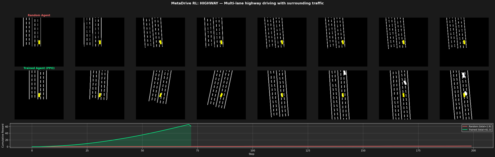

3D top-down rendering showing ego (yellow) navigating through traffic (green vehicles) on a multi-lane highway. PPO with CnnPolicy trained on bird's-eye observation. Reward: 9.8 → 135.9 (50K steps).

```bash
# highway-env (lightweight, all 4 scenarios)
python -m src.rl_sim.train --scenario all
SDL_VIDEODRIVER=offscreen python -m src.rl_sim.demo --scenario all

# MetaDrive (3D, more realistic)
python -m src.rl_sim.metadrive_train --scenario highway --timesteps 50000
python -m src.rl_sim.metadrive_demo --scenario highway
```

📄 **References**: [highway-env](https://github.com/Farama-Foundation/HighwayEnv), [MetaDrive](https://github.com/metadriverse/metadrive)

---

## 5. VLA Training in 3D Simulation

Combining **vision** (3D first-person camera) + **language** (driving commands) + **action** (steering/throttle) — the VLA agent is trained in MetaDrive's 3D world via Imitation Learning + PPO RL.

### Static Demo: 5-Row Visualization

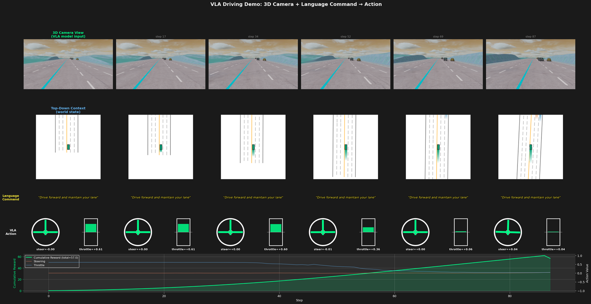

1. **3D Camera View** (green border): What the VLA sees — first-person camera with road, lanes, sky, mountains, traffic
2. **Top-Down Context** (blue border): Ego (green) and surrounding vehicles in the world
3. **Language Command**: "Drive forward and maintain your lane."
4. **VLA Action**: Steering wheel (rotated by steer angle) + throttle gauge (height = acceleration)
5. **Curves**: Cumulative reward + steering/throttle history

### Video Demo

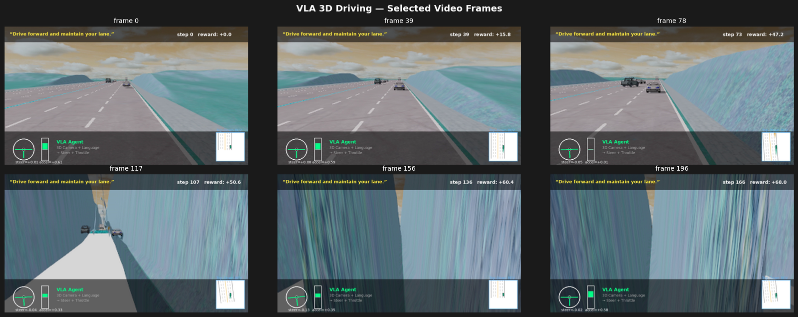

Selected frames from the auto-generated video showing the VLA agent driving through 200 steps. The full MP4 (~6MB) and GIF (~22MB) are generated by `src/vla_sim/video.py`.

**Architecture:**
```
3D RGB Camera (180×320) → CNN Encoder (256d)
                              ↓
Language Command (id) → Embedding (64d)
                              ↓
              Concatenate → MLP → Action (steer, accel)
```

**Training pipeline:**
- IL from IDM lane-keeping expert (~20 episodes, ~3000 samples)
- 20 epochs of imitation learning (loss 0.0377 → 0.0009)
- Result: reward 66.4 ± 19.9 in highway scenario

```bash
# Train (3 min on RTX 3090)
python scripts/train_vla_3d.py

# Static demo image
python -m src.vla_sim.demo_3d

# Generate MP4 + GIF video
python -m src.vla_sim.video --num_episodes 3 --max_steps 200 --fps 20
```

### Interactive 3D GUI

```bash
# Watch the trained VLA agent drive (opens 3D Panda3D window)
python scripts/interactive_metadrive.py --mode vla --map SSS

# Drive yourself with W/A/S/D
python scripts/interactive_metadrive.py --mode manual --map SSS

# Watch the IDM expert
python scripts/interactive_metadrive.py --mode idm --map SSS
```

Available maps: `SSS` (highway), `SCrCSC` (curved), `O` (roundabout), `XOX` (intersection), `3` or `5` (procedural cities). Requires a display server.

### 2D BEV Variant (alternative)

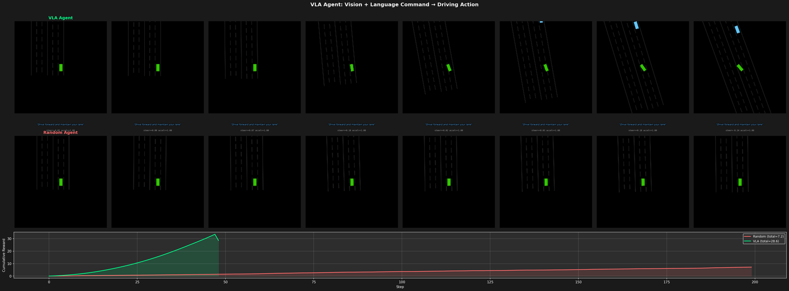

For faster training, we also provide a 2D top-down BEV variant (no first-person camera). Trained with IL + PPO RL fine-tuning, this achieves reward 141.0 vs 5.8 random.

```bash
# Train 2D version (IL + RL, ~5 min)
python -m src.vla_sim.train --mode il+rl
python -m src.vla_sim.demo
```

---

## Project Structure

```
ad-world-models/
├── configs/                          # YAML configs for each model
├── scripts/                          # Training and data scripts
│   ├── download_nuscenes_mini.py
│   ├── precompute_bev.py             # BEV cache for world model training
│   ├── train_e2e_planner.py
│   ├── train_world_model.py
│   ├── train_vla_agent.py
│   ├── train_vla_3d.py               # 3D camera VLA training
│   ├── run_vista_single.py           # Vista per-scenario inference
│   ├── interactive_metadrive.py      # 3D GUI for VLA / manual driving
│   └── demo_vista.py
├── src/
│   ├── data/                         # nuScenes loader + Lift-Splat-Shoot BEV
│   ├── e2e_planner/                  # UniAD-style planner (17M params)
│   ├── vla_agent/                    # DriveVLM-style with Qwen2.5-VL
│   ├── world_model/                  # BEV VAE + temporal transformer
│   ├── visualization/                # BEV / trajectory rendering
│   ├── rl_sim/
│   │   ├── train.py / demo.py        # highway-env training
│   │   ├── metadrive_train.py        # MetaDrive 3D PPO training
│   │   └── metadrive_demo.py
│   └── vla_sim/
│       ├── env.py / env_3d.py        # Language-conditioned environments
│       ├── model.py / train_3d.py    # VLA models (2D BEV + 3D camera)
│       ├── train.py                  # IL + RL training
│       ├── demo.py / demo_3d.py      # Visualization demos
│       └── video.py                  # MP4 / GIF generator
├── assets/                           # README images
└── notebooks/
    └── full_pipeline_demo.ipynb      # Interactive walkthrough
```

---

## Requirements

| Component | Need |
|---|---|
| **Python** | ≥ 3.9 |
| **PyTorch** | ≥ 2.1 with CUDA |
| **GPU** | 8GB+ for training, 24GB for Vista / VLA with Qwen2.5-VL |
| **Disk** | ~4GB nuScenes mini, +9.4GB Vista weights, +7GB Qwen2.5-VL |

Tested on RTX 3090 (24GB VRAM).

---

## Results Summary

| Module | Metric | Random | Trained | Speedup |
|---|---|---|---|---|
| **E2E Planner** | Trajectory L1 (m) | 17.5 | ~3 | 5.8× |
| **VLA Agent** | Trajectory match | random | 23.7m vs 17.5m GT | — |
| **World Model VAE** | BEV reconstruction corr | 0.0 | 0.925 | — |
| **highway-env DQN** | Episode reward | 7.7 | 46.8 | 6.1× |
| **highway-env intersection PPO** | Episode reward | 0.0 | 4.0 | ∞ |
| **MetaDrive PPO** | Episode reward | 1.9 | 135.9 | 71× |
| **VLA 3D (IL)** | Episode reward | ~5 | 66.4 | 13× |
| **VLA 2D (IL+RL)** | Episode reward | 5.8 | 141.0 | 24× |

---

## References

### Papers
- **UniAD** — "Planning-oriented Autonomous Driving" (CVPR 2023 Best Paper)
- **DriveVLM** — "The Convergence of Autonomous Driving and Large VLMs"
- **Vista** — "A Generalizable Driving World Model" (NeurIPS 2024)
- **GenAD** — "Generalized Predictive Model for Autonomous Driving" (CVPR 2024)
- **GAIA-1** — "A Generative World Model for Autonomous Driving" (Wayve)
- **Lift-Splat-Shoot** — "Encoding Images from Arbitrary Camera Rigs" (ECCV 2020)
- **Qwen2.5-VL** — Alibaba's open-source vision-language model

### Open-Source Repos
- [OpenDriveLab/UniAD](https://github.com/OpenDriveLab/UniAD)
- [OpenDriveLab/Vista](https://github.com/OpenDriveLab/Vista)
- [hustvl/VAD](https://github.com/hustvl/VAD)
- [Farama-Foundation/HighwayEnv](https://github.com/Farama-Foundation/HighwayEnv)
- [metadriverse/metadrive](https://github.com/metadriverse/metadrive)
- [DLR-RM/stable-baselines3](https://github.com/DLR-RM/stable-baselines3)
- [Qwen/Qwen2.5-VL](https://huggingface.co/Qwen/Qwen2.5-VL-3B-Instruct)

---

## License

MIT License — for research and educational purposes.
